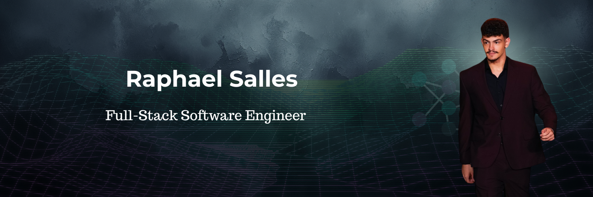

<h1 align="center">Olá! Me chamo Raphael Feijó Salles 👋</h1>

<h3 align="center">Engenheiro de Software Full-Stack | Unindo Tecnologia e Lógica de Negócios</h3>

  📍 Baseado em Londrina, PR, Brasil  
  💼 Focado em arquiteturas resilientes, análise de dados e performance na web.

  
  

---

## 👨‍💻 Sobre mim

Sou um desenvolvedor apaixonado por construir sistemas robustos e resolver problemas complexos de domínio. O meu principal diferencial é a intersecção entre o desenvolvimento de software e um forte interesse em **contabilidade e mercado financeiro**, o que me permite traduzir regras de negócio rígidas em arquiteturas de código limpas e escaláveis.

- 🏗️ Desenvolvendo soluções full-stack utilizando **Java, Spring Boot, React e TypeScript**.
- ☁️ Experiência com infraestrutura e automação, desde configurações web (DNS/Email) até o deploy de instâncias **AWS EC2** para operar robôs de trading (MetaTrader) ininterruptamente.
- 🧩 Utilizo a programação para otimizar processos diários, criando desde scripts com ExifTool para organização massiva de arquivos até plataformas de estudo.
- 🏋️‍♂️ Fora do código: Dedicado à musculação e sempre explorando novos rodízios de comida japonesa.

---

## 🚀 Projetos em Destaque

### 📈 [AçõesJá](https://github.com/RaphaelFeijoSalles/acoes-ja-showcase)
**Plataforma Full-Stack de Inteligência Financeira (Spring & React)**
Sistema de análise para o mercado de capitais focado em alta disponibilidade e consistência.
- **Backend (Java/Spring):** Garante o processamento seguro de regras de negócio com um pipeline ETL que ingere dados da CVM e os cruza com cotações externas. Destaque para a modelagem *Asset-first*, algoritmos de *Self-Healing* para balanços corrompidos e integrações com LLMs.
- **Frontend (React/TS):** Interface acessível com gráficos interativos e tutoriais guiados.

### 🎯 [LeetCode Tracker](https://github.com/RaphaelFeijoSalles/leetcode-tracker)
**Plataforma de Gestão de Estudos em Algoritmos (React & TypeScript)**
Aplicação frontend desenvolvida para rastreamento de progresso em estruturas de dados.
- Utiliza Custom Hooks para persistência de dados locais de forma eficiente.
- Interface totalmente responsiva com suporte a temas dinâmicos.
- Esteira de CI/CD 100% automatizada via GitHub Actions para deploy contínuo.

### ⚖️ [Portfólio Profissional](https://github.com/RaphaelFeijoSalles/portifolio-psicologa-eneida)
**Website Responsivo e Mobile-First (HTML5, CSS3, JS)**
- Prioriza alta performance e acessibilidade
- Arquitetura modular para landing pages de eventos
- Interações fluidas nativas (CSS Scroll Snap)
- Abrangeu toda a configuração de infraestrutura web (DNS e e-mail profissional).

---

## 💻 Tecnologias e Ferramentas

  
  **Backend & Banco de Dados** 
  
  
  
  
    
  **Frontend** 
  
  
  
  
  

    
  **Infraestrutura & DevOps** 
  
  
  
  
  

